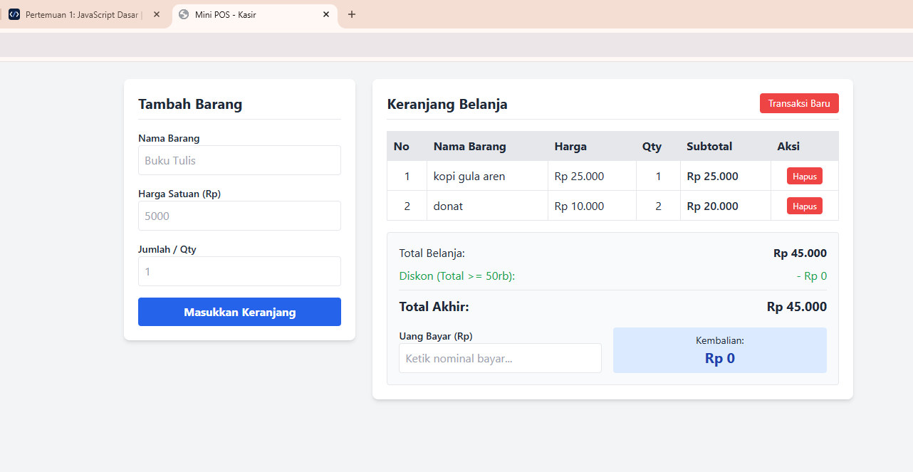
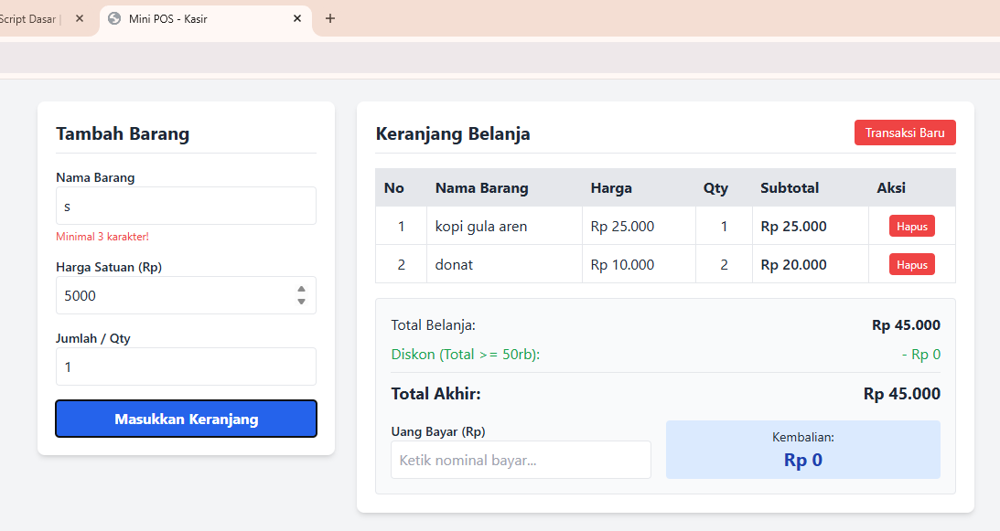
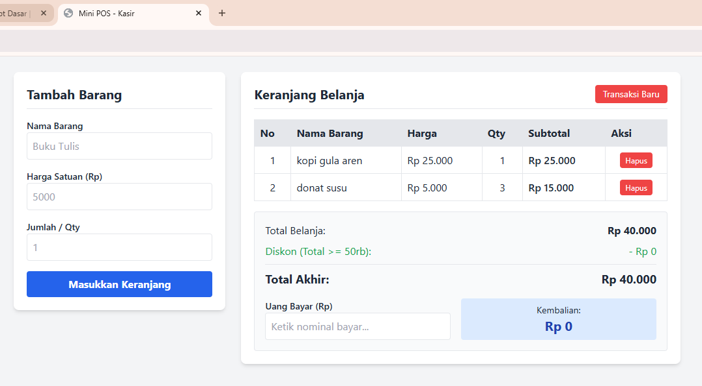

# Aplikasi Kasir & Keranjang Belanja Sederhana (Mini POS)

## Identitas
- **Nama Lengkap:** Najwa Syahirah Rosyan
- **NIM:** 123140178
- **Kelas Praktikum:** RB

## Deskripsi Aplikasi
Aplikasi **Mini POS** adalah sistem kasir berbasis web sederhana yang dirancang untuk kebutuhan kantin atau toko kampus. Aplikasi ini mengintegrasikan validasi input form, perhitungan kalkulator otomatis (subtotal, total belanja, diskon 10% untuk transaksi >= Rp 50.000, serta perhitungan uang kembalian), dan manajemen keranjang belanja persisten menggunakan `localStorage`.

## Panduan Menjalankan Aplikasi
1. *Clone* atau *download* repository ini dari GitHub.
2. Buka folder proyek di Visual Studio Code.
3. Klik kanan pada file `index.html` dan pilih **Open with Live Server**.
4. Aplikasi akan otomatis berjalan pada alamat lokal browser (contoh: `http://127.0.0.1:5500/index.html`).

## Daftar Fitur
- [x] **Validasi Input Form:** Menampilkan umpan balik teks merah jika nama < 3 karakter, harga < Rp 500, atau qty < 1.
- [x] **Kalkulasi Subtotal & Total:** Menghitung otomatis per baris item dan menjumlahkan total belanja keranjang.
- [x] **Kalkulator Diskon Otomatis:** Memberikan diskon 10% secara otomatis jika total belanja mencapai Rp 50.000 atau lebih.
- [x] **Kalkulator Pembayaran & Kembalian:** Menghitung uang kembalian secara real-time dan memberikan peringatan jika uang bayar belum mencukupi.
- [x] **Penyimpanan Persisten (LocalStorage):** Menyimpan daftar keranjang menggunakan `JSON.stringify()` dan memuat ulang data dengan `JSON.parse()`.
- [x] **Manajemen Keranjang:** Fitur hapus item per baris serta tombol "Transaksi Baru" untuk mereset seluruh data keranjang.

## Tangkapan Layar (Screenshot)

### 1. Tampilan Form Utama & Keranjang

### 2. Validasi Error Input

### 3. Hasil Perhitungan Total, Diskon & Kembalian

## Penjelasan Teknis Singkat
1. **Penanganan Validasi Input:** Menggunakan metode `e.preventDefault()` pada event `submit` form untuk menahan pengiriman data, lalu mengecek tiap field dengan sintaks percabangan `if`. Elemen ralat di-toggle menggunakan class `.hidden`.
2. **Algoritma Kalkulator:** Perhitungan menggunakan fungsi `renderKeranjang()` yang mengiterasi array `keranjang` untuk menghitung akumulasi total. Perhitungan kembalian dipemicu secara real-time melalui event `input` pada elemen uang bayar.
3. **Mekanisme Serialisasi LocalStorage:** Data keranjang yang berbentuk *Array of Objects* diubah menjadi tipe string menggunakan `JSON.stringify()` saat disimpan ke `localStorage.setItem()`. Saat aplikasi pertama kali dimuat, data diambil dan diubah kembali menjadi objek JavaScript menggunakan `JSON.parse()`.